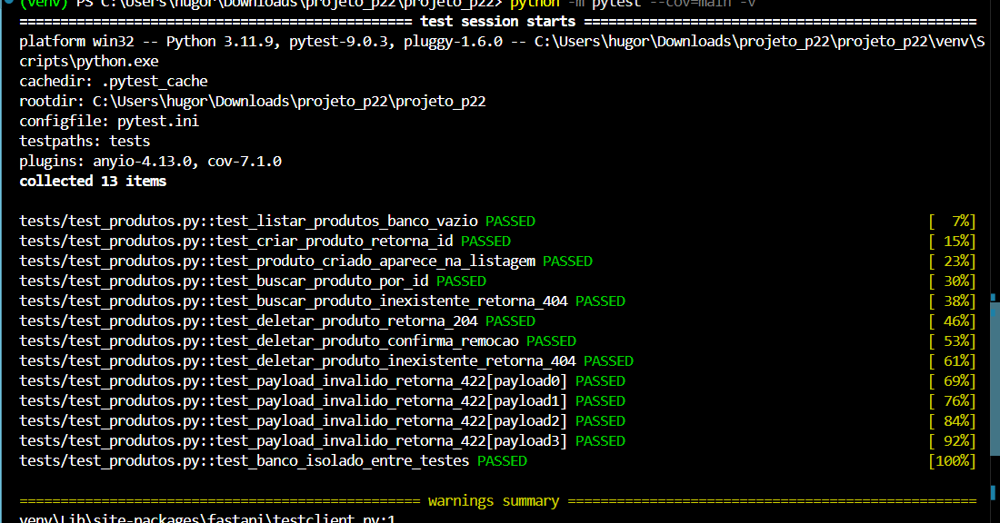

# API de Produtos

API REST para gerenciamento de produtos, desenvolvida com FastAPI e PostgreSQL.

## Como executar a aplicação

### 1. Subir os bancos de dados

```bash
docker-compose up -d db db_test
```

### 2. Criar e ativar o ambiente virtual

```bash
python -m venv venv
venv\Scripts\activate
```

### 3. Instalar dependências

```bash
pip install -r requirements.txt
```

### 4. Rodar a aplicação

```bash
uvicorn main:app --reload
```

Acesse a interface do CRUD em: http://localhost:8000/docs

## Como executar os testes

```bash
python -m pytest --cov=main -v
```

## Saída esperada



## Como o isolamento funciona

Cada teste recebe um banco limpo. A fixture `client` no `conftest.py` cria as tabelas antes do teste com `create_all` e destrói tudo depois com `drop_all`. Isso garante que nenhum dado de um teste interfere no próximo.
